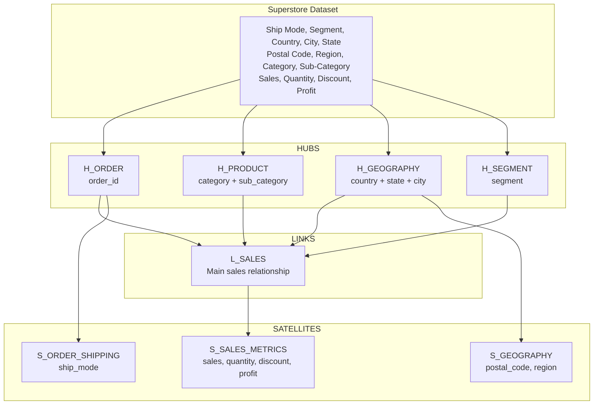
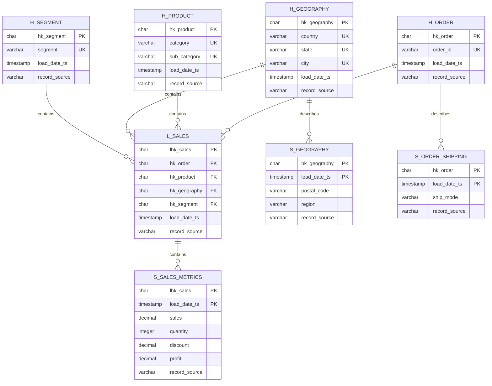

# Data Vault модель для Superstore

## Структура данных

**Исходные данные:** Ship Mode, Segment, Country, City, State, Postal Code, Region, Category, Sub-Category, Sales, Quantity, Discount, Profit [https://www.kaggle.com/datasets/roopacalistus/superstore] 

## Архитектура хранилища данных

### Хабы (Hubs)

- **H_ORDER** - Хаб заказов

       Содержит уникальные идентификаторы заказов для группировки связанных продаж.

- **H_PRODUCT** - Хаб продуктов

        Хранит уникальные комбинации категорий и подкатегорий продуктов.

- **H_GEOGRAPHY** - Хаб географии

        Содержит уникальные географические локации (страна-штат-город).

- **H_SEGMENT** - Хаб сегментов

        Хранит уникальные сегменты клиентов для маркетингового анализа.

- **L_SALES** - Связь продаж

        Основная связь, объединяющая все измерения продаж для многомерного анализа.

### Связи (Links)

- **L_SALES** - Связь продаж

        Основная связь, объединяющая все измерения продаж для многомерного анализа.

### Спутники (Satellites)

- **S_GEOGRAPHY** - Спутник географических атрибутов

        Хранит изменяемые атрибуты географических локаций с историей изменений.

- **S_ORDER_SHIPPING** - Спутник атрибутов доставки

        Содержит информацию о способах доставки заказов с возможностью отслеживания изменений.

- **S_SALES_METRICS** - Спутник метрик продаж

        Хранит ключевые бизнес-метрики продаж с поддержкой исторических изменений.

## Структура таблиц

**Оптимизация типов данных**

- CHAR(32) для hash ключей - фиксированная длина для оптимальной производительности JOIN операций
- DECIMAL(15,4) для финансовых данных - высокая точность без потери производительности
- DECIMAL(5,4) для скидок - точное представление процентных значений
- VARCHAR с оптимальными размерами - баланс между производительностью и гибкостью

**Ограничения целостности данных**

- PRIMARY KEY на всех таблицах для уникальности
- FOREIGN KEY для обеспечения ссылочной целостности
- UNIQUE ограничения на бизнес-ключи
- CHECK ограничения для бизнес-правил (положительные значения, диапазоны)

